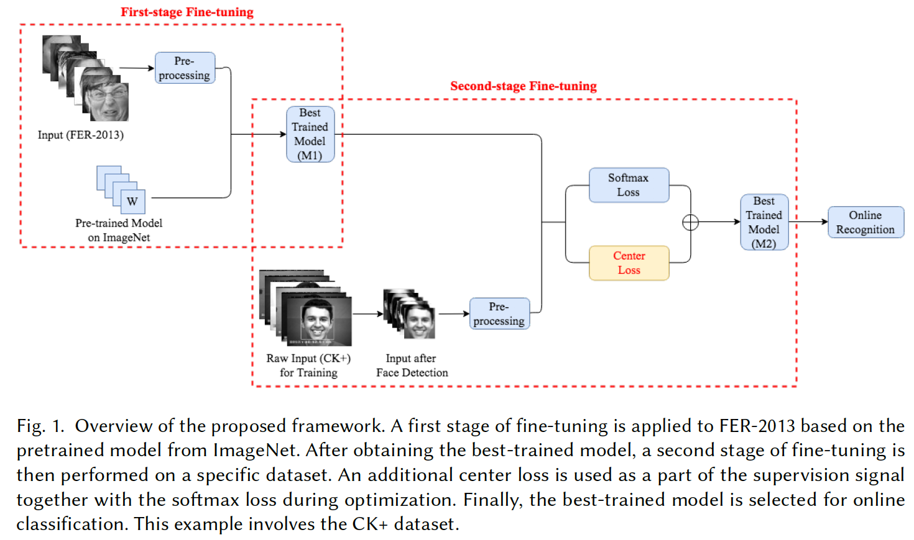
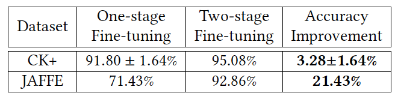
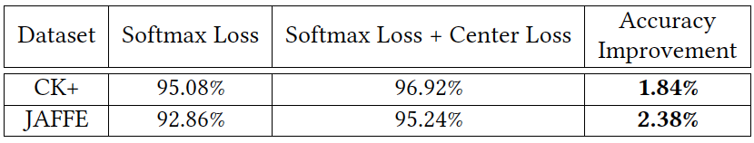
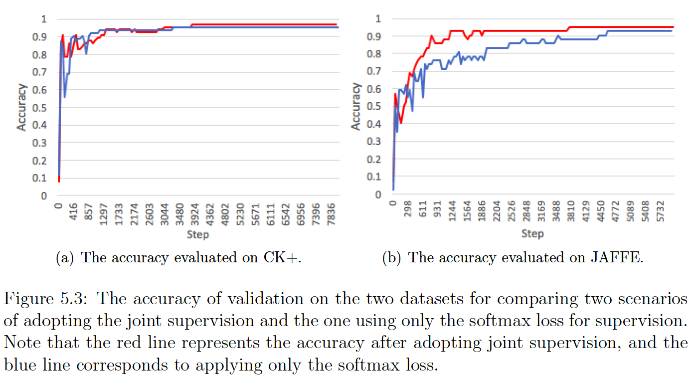
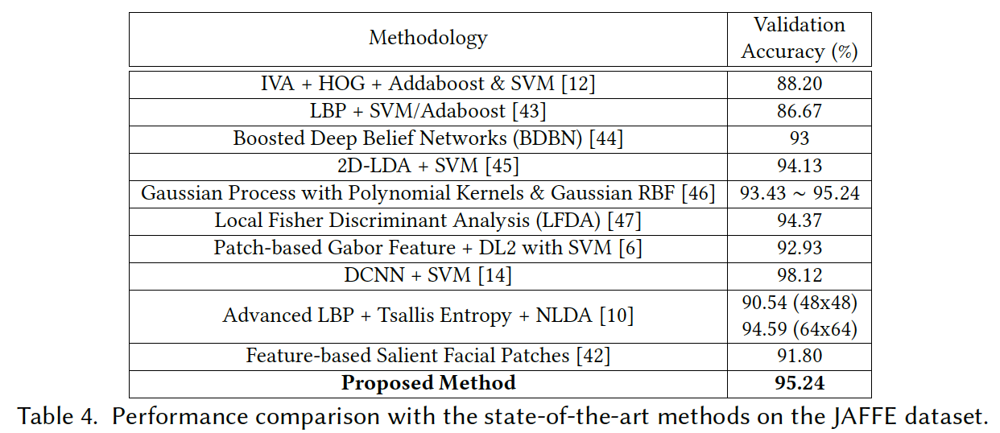
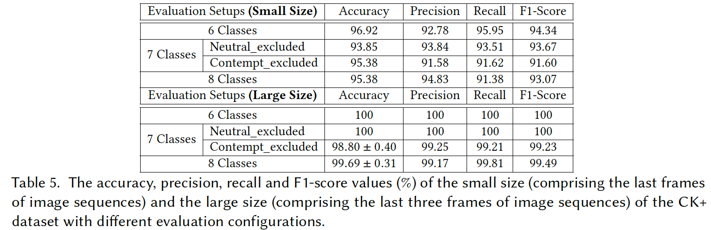
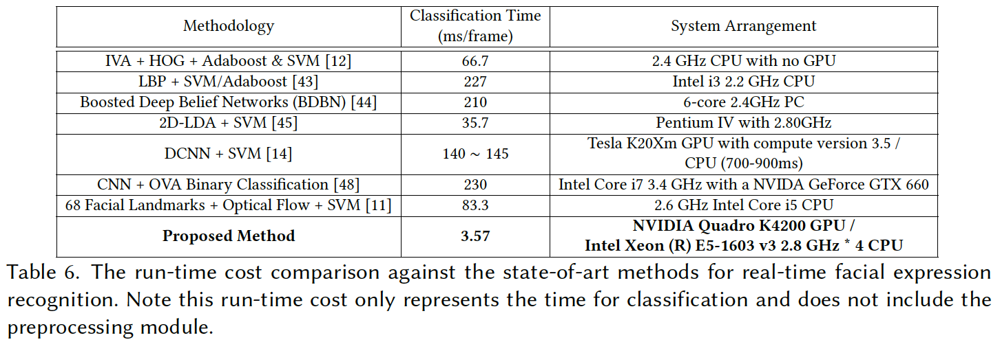

# A Real-Time Facial Expression Recognition System
A real-time facial expression recognition (FER) system that can recognize one of the basic facial expressions of several subjects from the webcam at the same time. Our proposed methodology combines a supervised transfer learning strategy and a joint supervision method with the center loss which is crucial for facial tasks. A newly proposed Convolutional Neural Network (CNN) model, **MobileNet**, that contains both accuracy and speed is deployed in both offline and real-time framework which enables fast and accurate real-time output. Evaluations towards two publicly available datasets, **JAFFE** and **CK+**, are carried out respectively. It reaches an accuracy of 95.24% on JAFFE dataset, and an accuracy of 96.92% on 6-class CK+ dataset which only contains the last frames of image sequences. At last, the average run-time cost for the recognition of the real-time implementation is around 3.57 ms/frame on an NVIDIA Quadro K4200 GPU.

## Pre-requisite Libraries
* Python 2.7
* Tensorflow
* NumPy
* OpenCV-Python

## Datasets:

### [FER-2013:](https://www.kaggle.com/c/challenges-in-representation-learning-facial-expression-recognition-challenge/data) (First-stage fine-tuning)
The data consists of 48x48 pixel grayscale images of faces. 

Convert the original **csv** file into **tfrecords** by first split it into three subsets (train.csv, valid.csv, test.csv) running the ***convert_fer2013.py*** under the **data_preparation** folder. 

After converting the csv files into **.jpg** format in each class folders (***csv_to_gray.py***), running the  ***create_tfrecord_from_img.py*** to generate the tfrecord files.

### [JAFFE](http://www.kasrl.org/jaffe.html), [CK+:](http://www.consortium.ri.cmu.edu/ckagree/) (Second-stage fine-tuning)

Face detection using the [Haar cascade classifier](https://docs.opencv.org/3.4.3/d7/d8b/tutorial_py_face_detection.html) which is based on the object detection classifier in OpenCV.  

During training, all the input images are resized into 48x48 for consistency.

## The Framework and Transfer Learning
### CNN Structure:
The first version of MobileNet (MobileNet V1) [1] is employed as the CNN architecture in both offline and real-time systems of our work since it focuses both on speed and size, and it is easy to be tuned for resources versus accuracy as highlighted in the paper. The core of the MobileNet V1 is that it decouples standard convolution into a depthwise convolution and a 1 × 1 pointwise convolution.

### Transfer Learning Strategy
One main problem for CNN-based FER is the insufficient size of the most of existing facial expression datasets. The required size of the labeled training data for CNNs to learn and extract features and obtain high accuracies is asked to be in millions while the size of most facial expression datasets is only hundreds or thousands. Training deep models with such limited amount of data is rather challenging since sometimes it may lead to the problem of overfitting. In addition, it is time-consuming for training from scratch without taking advantage of the pretrained model. One of the common ways to address this problem is to use the so-called fine-tuning strategy. A hallmark of this approach is the fine-tuning of a small target dataset based on the pretrained models on the ILSVRC-2012 (ImageNet). To further
compensate for the small size of the CK+ and JAFFE datasets during fine-tuning (the size of which both are under 1K) and overcome the difference between the target task and the source task, we follow the recent studies of [2, 3] using the FER-2013 dataset (the size of which is more than 30K).

The pretrained model from ImageNet on MobileNet for the first-stage fine-tuning can be found in the for [Tensowflow Slim](https://github.com/tensorflow/models/tree/master/research/slim) library on github.

### Joint Supervision
Inspired by the work of Wen et al. [4], the center loss is applied in the training scheme in order to the discriminatory power. In the training process, the center loss acts to reduce the intraclass differences by increasing the distance constraint between the features and its corresponding class center of the samples.

## Experiments and Evaluations
### Training:
**RT-FER/train_image_classifier.py**

### Offline Experiments：
**RT-FER/eval_image_classifier.py**

#### 1. Effects of Two-stage Fine-tuning:

#### 2. Effects of Center Loss:

#### 3. Evaluation on JAFFE Dataset:

#### 4. Evaluation on CK+ Dataset:

### Real-time Experiment:

Note also that when taking any arbitrary number M of people in a single frame of camera into account, the total time cost for this frame is *46.93 + M × (7.49 + 3.57)* ms.

## References
> [1] Andrew G Howard, Menglong Zhu, Bo Chen, Dmitry Kalenichenko, Weijun Wang, Tobias Weyand, Marco Andreetto, and Hartwig Adam. 2017. Mobilenets: efficient convolutional neural networks for mobile vision applications. arXiv preprint arXiv:1704.04861.
> 
> [2] Bo-Kyeong Kim, Jihyeon Roh, Suh-Yeon Dong, and Soo-Young Lee. 2016. Hierarchical committee of deep convolutional neural networks for robust facial expression recognition. Journal on Multimodal User Interfaces, 10, 2, 173–189.
> 
> [3] Hong-Wei Ng, Viet Dung Nguyen, Vassilios Vonikakis, and Stefan Winkler. 2015. Deep learning for emotion recognition on small datasets using transfer learning. In Proceedings of the 2015 ACM on International Conference on Multimodal Interaction, 443–449.
> 
> [4] Yandong Wen, Kaipeng Zhang, Zhifeng Li, and Yu Qiao. 2016. A discriminative feature learning approach for deep face recognition. In Proceedings of the European Conference on Computer Vision, 499–515.

